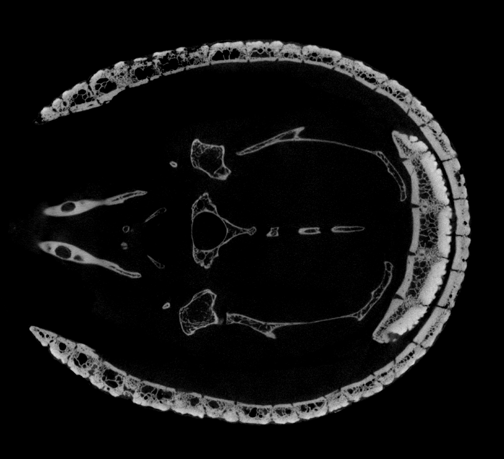

# 3D SLICER WORKSHOP APRIL 2025 

Hi everybody, and welcome to the main page for our 3DSlicer workshop! Thanks for joining me to learn about how to make this set of powerful tools work for you.

## Learning objectives:

By the end of this workshop, you will:
- Understand the basic structure of different kinds of 3D data you might work on in Slicer
- Feel comfortable with navigating the Slicer interface and be able to install, open, and update modules
- Be able to import and visualize several types of 3D data
- Know the basics of segmentation and model generation
- Understand how to expand your knowledge of Slicer moving forward, and become familiar with the many Slicer community resources

## Tentative schedule

### April 14, 2025: 9:00am-4:30pm

9-10am: Welcome, setup, introduction to the course and 3D data types, hardware introduction

10-11am: Slicer basics: where are the important buttons? and how do I get my data in there? 

11am-12:30pm: Segmentation: Intro, demonstration, and practice

12:30pm-1:30pm: Lunchtime!

1:30pm-3pm: Continued segmentation and visualization, including advanced segmentation tools

3pm-4pm: Production of meshes and mesh quality checking

4pm-4:30pm: Wrap up and discussion of additional resources

## Slicer and SlicerMorph Citations

To cite 3D Slicer as a general purpose biomedical visualization platform, please use: Kikinis, R., Pieper, S. D., & Vosburgh, K. G. (2014). 3D Slicer: A Platform for Subject-Specific Image Analysis, Visualization, and Clinical Support. In Intraoperative Imaging and Image-Guided Therapy (pp. 277–289). Springer, New York, NY. https://doi.org/10.1007/978-1-4614-7657-3_19

If you use SlicerMorph in your research, please cite this publication. To cite additional specific parts of the SlicerMorph toolset (e.g., ALPACA for 3D Geometric morphometrics), consult the SlicerMorph github!

* **SlicerMorph** as a general platform for digital morphology: Rolfe, S., Pieper, S., Porto, A., Diamond, K., Winchester, J., Shan, S., … Maga, A. M. (2021). _SlicerMorph: An open and extensible platform to retrieve, visualize and analyze 3D morphology._ Methods in Ecology and Evolution, 12:1816–1825. https://doi.org/10.1111/2041-210X.13669 (Open access)

[Follow this link to obtain a list of publications that cite the main SlicerMorph paper (Rolfe et al., 2021)](https://scholar.google.com/scholar?hl=en&as_sdt=5,48&sciodt=0,48&cites=13786917364486709604&scipsc=&q=&scisbd=1)
